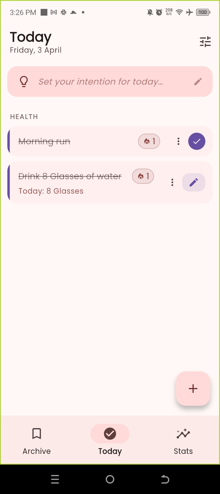
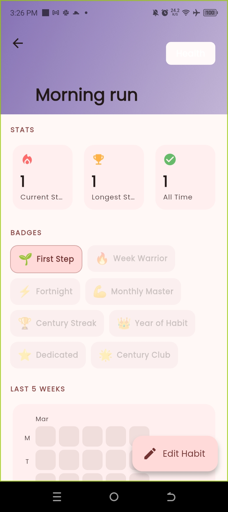
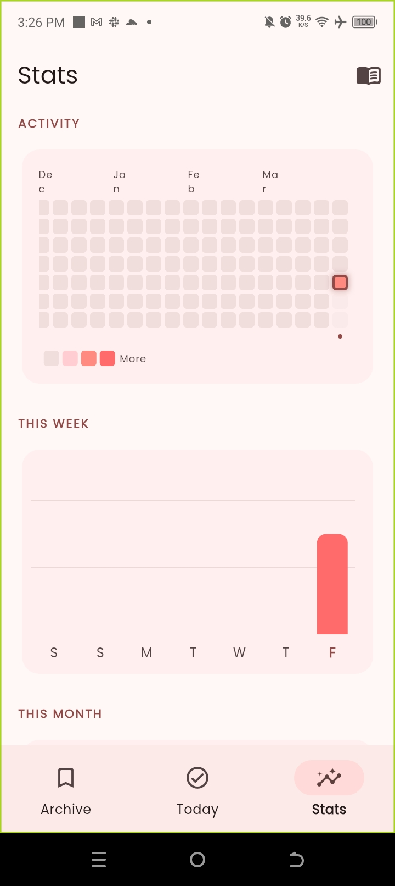
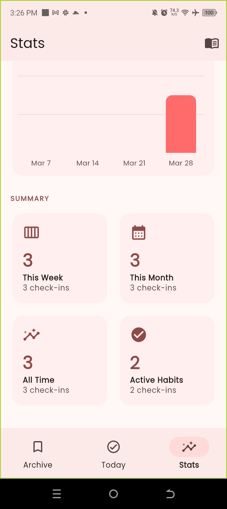
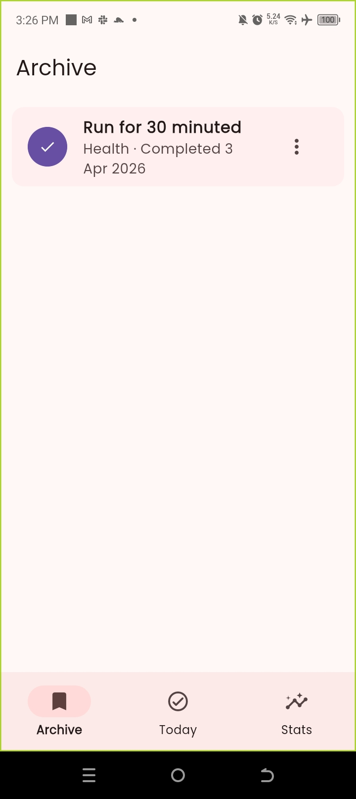
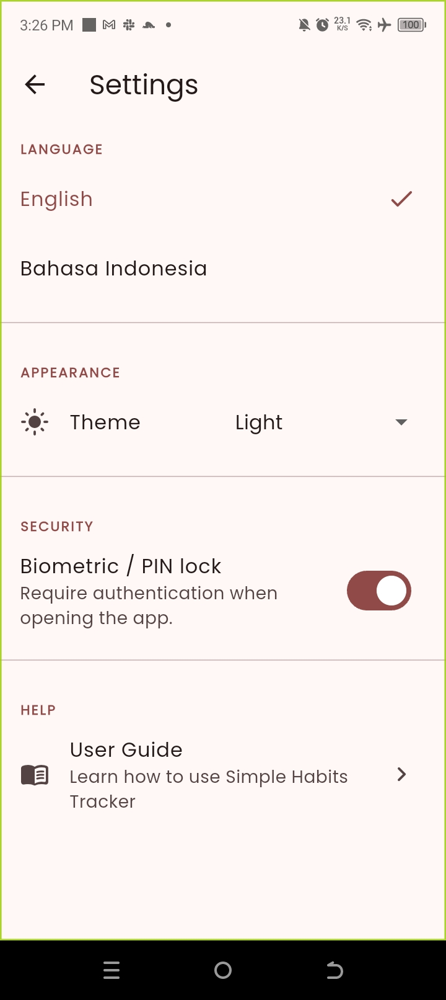

# Simple Habits Tracker

A clean, minimal, and fully offline habit tracker for Android. Build better habits — one day at a time.

---

## Features

- **Habit creation** — Boolean (done/not done), numeric (count), or duration (minutes) tracking
- **Goal-bound & ongoing modes** — Set a target end date or track indefinitely
- **Streak tracking** — Current and longest streaks with grace period support
- **Daily Intention** — Set a daily focus at the top of the Today screen; persists per day, resets each morning
- **In-app User Guide** — 11 expandable sections covering every feature, accessible from Settings → Help
- **Pause habit** — Pause for tomorrow, 3 days, 1 week, 2 weeks, or indefinitely; auto-resumes
- **Archive** — Completed goal-bound habits and retired ongoing habits land here as a trophy room; restore or delete permanently via ⋮ menu
- **Milestone badges** — 8 badges computed from streak and total completions, shown on the habit detail screen
- **GitHub-style heatmap** — 17-week activity grid on the Stats tab, auto-scrolls to today
- **Weekly & monthly bar charts** — Last 7 days and last 4 weeks completion overview
- **Journal** — Optional per-check-in notes, browsable chronologically
- **Habit detail screen** — Collapsing header, 5-week history calendar, stats, and recent notes
- **Daily reminders** — Per-habit scheduled notifications (fully offline)
- **Biometric / PIN lock** — Secure the app with device biometrics or PIN; auto-disables if unavailable
- **Multilingual** — English and Bahasa Indonesia
- **Theme** — Light, dark, or follow system
- **Onboarding** — First-run language picker and optional security setup

---

## Screenshots

| Today | Habit Detail | Stats |
|:---:|:---:|:---:|
|  |  |  |

| Stats Summary | Archive | Settings |
|:---:|:---:|:---:|
|  |  |  |

| User Guide |
|:---:|
|  |

---

## Tech Stack

| Layer | Library |
|---|---|
| Framework | Flutter (Dart) |
| Database | Drift (type-safe SQLite with reactive streams) |
| State management | Riverpod |
| Notifications | flutter_local_notifications |
| Biometric auth | local_auth |
| Settings persistence | shared_preferences |
| Localisation | flutter_localizations + ARB files |
| Charts | fl_chart |

---

## Getting Started

### Prerequisites

- Flutter SDK 3.x
- Android device or emulator (API 23+)
- Android Studio (for device tooling)

### Run

```bash
flutter pub get
flutter run
```

### Build release APK

```bash
flutter build apk --release
```

### Build release AAB (Play Store)

```bash
flutter build appbundle --release
```

> Signing requires a `android/key.properties` file and a `.jks` keystore — neither is committed to this repo.

---

## Project Structure

```
lib/
├── core/
│   ├── database/       # Drift tables (Habits, CheckIns) and DAOs
│   ├── notifications/  # Per-habit daily notification scheduling
│   ├── providers/      # databaseProvider, sharedPreferencesProvider
│   └── theme/          # AppTheme (light + dark, Material 3)
├── features/
│   ├── auth/           # Biometric/PIN lock screen (AuthGate)
│   ├── habits/         # Today screen, habit cards, category sections
│   ├── add_edit_habit/ # Create/edit bottom sheet
│   ├── checkin/        # Check-in bottom sheet (value + optional note)
│   ├── habit_detail/   # Detail screen: stats, 5-week calendar, notes
│   ├── onboarding/     # First-run flow: language + security setup
│   ├── settings/       # Settings screen: language, theme, biometric toggle
│   ├── shell/          # MainShell — bottom nav (Archive | Today | Stats)
│   ├── stats/          # Stats tab: heatmap, charts, journal
│   └── archive/        # Archive tab: completed and retired habits
└── shared/
    ├── models/         # HabitWithStatus, JournalEntry
    ├── utils/          # StreakCalculator
    └── widgets/        # StreakBadge, EmptyState
```

---

## Architecture

- **Data** — Drift DAOs expose `Stream`s that flow directly into Riverpod `StreamProvider`s, so the UI rebuilds reactively on any database change. No extra repository abstraction.
- **Settings** — `SharedPreferences` loaded before `runApp()`, injected via provider override. All mutations persist immediately.
- **Auth** — `AuthGate` wraps `MainShell`. Auto-disables if the device has no lock screen set up so users can never be locked out. A recovery option appears after repeated failures.
- **Routing** — `app.dart` watches `settingsProvider` and routes to `OnboardingScreen`, `AuthGate`, or `MainShell` reactively.
- **Localisation** — `context.l10n` via a `BuildContext` extension. Run `flutter gen-l10n` after any ARB change.

---

## Android Notes

- `minSdk = 23` required (biometric API)
- `MainActivity` extends `FlutterFragmentActivity` (required by `local_auth`)
- Core library desugaring enabled for `flutter_local_notifications`
- Required permissions: `USE_BIOMETRIC`, `USE_FINGERPRINT`, `POST_NOTIFICATIONS`, `SCHEDULE_EXACT_ALARM`, `RECEIVE_BOOT_COMPLETED`

---

## Roadmap

| Version | Highlights |
|---|---|
| v1.0 ✅ | ✅ Habit creation, ✅ streaks, ✅ notifications, ✅ categories, ✅ home widget, ✅ biometric lock, ✅ multilingual, ✅ onboarding |
| v1.5 ✅ | ✅ Heatmap, ✅ weekly/monthly charts, ✅ journal, ✅ pause habit, ✅ habit detail screen, ✅ dark/light/system theme |
| v2.0 ✅ | ✅ Milestone badges, ✅ Archive restore/delete, ✅ Daily Intention screen, ✅ per-habit accent color |
| v2.1 ✅ | ✅ In-app User Guide (11 sections, bilingual EN + ID) |
| v2.1.1 ✅ | ✅ Fix: New Habit modal not closing after save, ✅ Fix: app version showing 1.0.0 in device info |

---

## License

MIT
